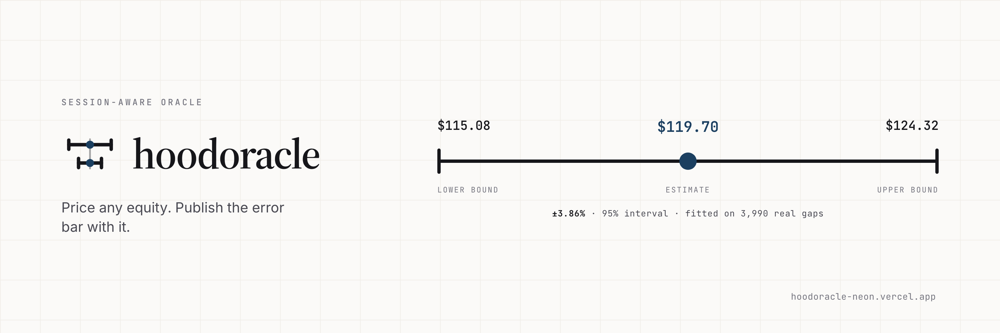

<div align="center">



### Session-aware price feeds for tokenised equities

**The price, where it came from, and how much to trust it — right now.**

[](./LICENSE)
[](https://soliditylang.org/)
[](https://explorer.mainnet.chain.robinhood.com)
[](#the-track-record)
[](#tests)

**[Live feeds](https://www.hoodoracle.org)** · **[Track record](https://www.hoodoracle.org/coverage)** · **[Docs](https://www.hoodoracle.org/docs)** · **[Integrate](https://www.hoodoracle.org/integrate)** · **[Playground](https://www.hoodoracle.org/playground)**

</div>

---

## Live on Robinhood Chain mainnet

| Contract | Address | What it does |
|---|---|---|
| **HoodOracle** | [`0x65cf45524407a5e700188a8a8178d5d5c0c38d30`](https://explorer.mainnet.chain.robinhood.com/address/0x65cf45524407a5e700188a8a8178d5d5c0c38d30) | Verifies signed quotes; session-aware read interface |
| **HoodOracleKeeper** | [`0xc984336bf8f5218c601bbb1a83a070262b694aee`](https://explorer.mainnet.chain.robinhood.com/address/0xc984336bf8f5218c601bbb1a83a070262b694aee) | Batch relaying and on-chain staleness discovery |

**Chain** Robinhood Chain (4663), an Arbitrum Orbit L2 · **Signer** `0xA139E54E6c88420cb5546c64130d1Ba145Ff9C8A` · **Status** evaluation build, contracts unaudited

---

## What is hoodoracle?

Robinhood Chain went live on 1 July 2026 as an Arbitrum Orbit L2 and trades
tokenised US equities around the clock, with DeFi lending on top. The shares
those tokens represent price for six and a half hours a day. **Roughly a third
of every week has no price discovery at all**, and a tokenised position can be
lent against or liquidated in every hour of it.

Every other oracle returns one number and hides which regime it came from.
hoodoracle returns the number together with how it was obtained and how much to
trust it right now.

### What it does that other equity oracles do not

| | |
|---|---|
| **Provenance on every quote** | `TRADED`, `DERIVED` or `STALE`. You always know whether a price is an observed print or a model output, and `getPriceIfTraded` reverts rather than hand a liquidation path a modelled weekend price. |
| **A calibrated confidence band** | Fitted on 3,990 realised close-to-open gaps across 8 instruments, not a hand-picked constant. 94.9% of historical gaps landed inside it. |
| **A published track record** | Every band published is scored against the print that settled it, computed from the chain's own event log with no database in between. Anyone can recompute it. |
| **Session awareness** | `REGULAR`, `PRE`, `POST`, `CLOSED`, `HOLIDAY`, from a real NYSE calendar with DST, holidays and early closes. |
| **Pull, not push** | Quotes are signed off-chain and posted on demand. A weekend price does not change for 62 hours, so publishing it on a heartbeat would be paying gas to say nothing. |
| **Permissionless relaying** | The contract authenticates the signature, not the sender. Anyone may post a fresher quote, and anyone may run a keeper. |
| **No single upstream** | Providers are pluggable; the consensus price is the median, so one bad feed cannot drag it, and their real disagreement widens the band. |

---

## Sourcing

No single upstream. Providers are pluggable and the oracle runs on whichever are
configured, so no vendor's terms or uptime become ours.

| Provider | Key needed | Reports print time | Terms | Default |
|---|---|---|---|---|
| Yahoo Finance | no | yes | unofficial | **on** |
| Alpaca (IEX) | free | yes | free-tier | off |
| Finnhub | free | yes | free-tier | off |
| Twelve Data | free | no | free-tier | off |
| DIA | no | no | evaluation-only | off |

The consensus price is the **median** across whichever resolved, so one bad feed
cannot drag it. `maxDeviationBps` is the real spread between them and widens the
band directly. Only providers that report genuine print times may establish
freshness; the rest can contribute a price but not a timestamp.

DIA is off by default. Their own configuration documents the free tier as
evaluation-only, and their RWA endpoint stamps some tickers with fetch time
rather than print time. Set `DIA_ENABLED=true` to include it as a cross-check.

Yahoo is marked `unofficial`: it needs no key and reports a real
`regularMarketTime`, which makes it the best free source for freshness, but it
is not licensed for commercial redistribution. Fine for building, not a
production source. Add a licensed vendor before going live.

## Quick start

```bash
npm install
cp .env.local.example .env.local   # or let it generate an ephemeral dev key
npm run dev
```

```bash
curl localhost:3000/api/quote/HOOD
```

## What it returns

```jsonc
{
  "quote": {
    "ticker": "HOOD",
    "price": 119.885308,        // what to use
    "anchorPrice": 119.83,      // last price actually seen on tape
    "confidenceBps": 86,        // ±0.86%
    "session": 3,               // CLOSED
    "provenance": 1,            // DERIVED
    "lastTradeTime": 1789775964,
    "driftBps": 4.3,
    "method": "Tape is shut. Close from 1 source drifted by a 0.45 beta against
               a -0.07% blended BTC/ETH move measured over the same 4.7h window."
  },
  "signature": "0x7e6e…",
  "signer": "0xA139…"
}
```

A consumer contract reads `provenance` before it reads `price`.

## Endpoints

| Endpoint | Returns |
|---|---|
| `GET /api/quotes` | Every instrument, priced against one proxy snapshot |
| `GET /api/quote/:ticker` | One instrument, signed, with digest and signer |
| `GET /api/health` | Upstream reachability, signer, relayer, on-chain freshness. 503 when upstream is down or the chain has stopped being fed |
| `GET /api/coverage` | The published track record, scored from chain logs |

## Pages

| Route | |
|---|---|
| `/` | Live feed board with session state and countdown |
| `/why` | The problem, the weekly calendar, the model |
| `/docs` | Field semantics, confidence model, signature verification |
| `/playground` | Live API calls against the running service |
| `/coverage` | Every band we published, scored against the print that settled it |
| `/integrate` | SDK, Solidity interface and consumer policy examples |
| `/feed/:ticker` | Per-instrument detail with the signed payload |

## The confidence model

```
live print:
  bps = BASE[session] + maxDeviationBps       // 8 regular, 35 pre/post

gap (DERIVED or STALE):
  sigma = overnightSigmaBps * (hours/17.5)^k  // both fitted
  bps   = 1.96 * sigma + maxDeviationBps      // two-sided 95%
  bps   = max(bps, BASE[CLOSED])              // never tighter than a live one
```

Every parameter is **fitted**, not chosen. `npm run calibrate` regresses two
years of realised close-to-open gaps against the blended BTC/ETH move over the
identical window and writes `src/lib/calibration.json`.

### The √t model was wrong

The first version widened the band by `√t`, on the standard argument that
uncertainty under a random walk grows with the square root of elapsed time.
Fitting `σ ∝ hours^k` against real gaps gives:

```
median k = 0.107        (√t would be 0.50)
```

A weekend is ~3.7x the clock hours of an overnight gap, yet its realised
dispersion is only a few percent wider. Calendar time is a poor clock for market
risk: information arrives around the close and the open, not evenly through
Saturday.

The practical consequence is that **almost all of the weekend's uncertainty
exists the moment the bell rings.** A protocol that widens gradually through a
weekend is mispricing Friday evening. The old model went ±0.53% → ±6.84% across
a weekend; the fitted one goes ±3.60% → ±4.80%, which is what actually happens.

### Fitted parameters

| Ticker | Fitted β | Prior β | R² | Overnight σ | Weekend σ | Coverage |
|---|---|---|---|---|---|---|
| HOOD | 0.690 | 0.45 | 0.379 | 215 | 232 | 93.8% |
| COIN | 0.791 | 0.60 | 0.557 | 180 | 165 | 93.4% |
| NVDA | 0.275 | 0.20 | 0.148 | 150 | 184 | 95.0% |
| TSLA | 0.357 | 0.25 | 0.172 | 188 | 218 | 95.2% |
| AAPL | 0.115 | 0.12 | 0.064 | 104 | 124 | 96.4% |
| MSTR | 0.950 | 0.80 | 0.645 | 169 | 195 | 94.2% |
| SPY | 0.128 | 0.15 | 0.241 | 55 | 62 | 95.8% |
| TLT | 0.001 | 0.00 | -0.002 | 57 | 65 | 95.6% |

Every prior was too low except AAPL and TLT. R² is the share of gap variance the
crypto proxy explains: 56% for COIN, essentially zero for TLT, which is why TLT
gets no drift applied at all.

**Coverage** is the validation that matters. The band claims to be a 95%
interval, so every historical gap is replayed and counted. All eight land
between 93.4% and 96.4% across ~500 gaps each. That number is the difference
between a calibrated band and a guess.

### Off-hours drift

The proxy move is measured over **exactly the window the tape was shut**, from
BTC and ETH hourly closes. An earlier version scaled a 24h return by
`gapHours/24`, which assumed the move was spread evenly across the day and
stopped accumulating past 24 hours. Measuring the actual window removes both
fudges. Where the series does not reach back far enough, drift is zero rather
than extrapolated.

## The keeper

`HoodOracleKeeper` sits beside the oracle and does two things the oracle
deliberately does not.

```
keeper  0xc984336bf8f5218c601bbb1a83a070262b694aee
```

It mints no authority. Every quote it forwards is still checked against the
oracle's own signer allow-list, it holds no funds, has no owner and stores
nothing — so anything done through it could have been done without it, just in
more transactions. That is why it is a separate contract rather than a new
version of the oracle: adding these functions to `HoodOracle` would have minted
a new address, orphaned every integrator, forced the signer to be
re-allow-listed, and reset the published coverage archive. None of that buys
anything a caller can observe.

### Batch posting

```solidity
function postQuotes(string[] tickers, Quote[] quotes, bytes[] signatures)
    external returns (bool[] posted);
```

Measured on a real EVM with eight live quotes:

```
one-at-a-time  704,596 gas across 8 transactions
batched        556,345 gas in 1 transaction
saved          148,251 gas  (21.0%)
```

The gas is the smaller half. The real win is that **all eight land in one
block**. Posted separately they land across eight, so a consumer reading
mid-round gets a snapshot that never existed — HOOD from one block and TLT
from forty later, when the two were priced against a single proxy reading.

**A failed quote is recorded, not thrown.** The oracle rejects anything not
strictly newer than what it stores, and anyone may relay, so two relayers
racing on one ticker is an ordinary event. If the loop bubbled that revert, one
already-posted ticker would discard the other seven and burn the gas anyway.

The relayer **simulates before sending**. `postQuotes` reports per-quote
success in its return value and nothing observes that without waiting for a
receipt, which this endpoint deliberately does not do. An `eth_call` is free
and answers the same question first, so a forged or stale quote is caught
before it is paid for.

Batching is used only from two quotes upwards — a batch of one pays the
helper's call overhead to save nothing — and the relayer falls back to
one-at-a-time if the keeper is unset or unreachable. A keeper misconfiguration
cannot stop the feed.

### Keeper discovery

```solidity
function needsUpdate(string[] tickers, uint64 maxAge) view returns (bool[]);
function status(string[] tickers, uint64 maxAge) view returns (Status[]);
```

Which tickers are stale was previously known only to the scheduler posting
them, behind a shared secret. That made one cron job a single point of failure
for a feed **anyone is allowed to write to** — and it froze production once
already. Both functions are `view`, so asking costs nothing and needs no
permission.

`status` exists because eight separate `getQuote` calls are eight network round
trips that can interleave with a post, so a keeper built on them can act on a
view of the feed that never existed at any instant. One call is one block.

A ticker that was never posted reverts inside the oracle; both functions catch
that and report it as needing an update, which is what it needs. One unknown
symbol in the array does not blind a keeper to the other seven.

```bash
npm run deploy:keeper -- rh-mainnet   # DEPLOYER_KEY + DEPLOY_CONFIRM=yes
```

## The track record

The confidence model is validated by a backtest. A backtest is evidence about
the past; it is not evidence that the thing running in production is still
right. So every band the contract has accepted is scored against the print
that settled it.

```bash
npm run ledger          # or GET /api/coverage, or visit /coverage
```

**The archive is the chain.** There is no database. The contract keeps only
the latest quote per ticker in storage, but every quote it ever accepted
survives as a `QuotePosted` log signed by an allow-listed key. So the record
cannot be edited after the fact, does not depend on any service of ours
staying up, and anyone can recompute the numbers from Robinhood Chain without
asking us for anything. A Postgres mirror would be faster and strictly less
trustworthy.

### How a band is scored

A quote whose provenance is not `TRADED` is a claim about a price nobody can
observe yet. The first `TRADED` quote that follows it, for the same ticker, is
the observation that settles the claim.

- **At reopen** — the headline. One score per closure, using the last band
  published before the tape reopened. The fitted sigma is anchored on a
  *complete* close-to-open gap, so the band only claims to cover the whole gap
  once the whole gap has elapsed. This is the only apples-to-apples comparison
  with the backtest.
- **All during closure** — every band published during the same closure,
  against the same print. Reads lower by construction, because the band widens
  with elapsed staleness: a quote published an hour into a 62-hour weekend
  carries an overnight-sized band against a weekend-sized move. Reported
  anyway, because a consumer reading the feed on Saturday morning gets that
  quote, not the Monday one.
- **Not scored** — consecutive live prints. A `TRADED` band is source
  dispersion around a price that already exists, not a forecast, so testing
  the next print against it would test a claim the oracle never made.

Band edges are computed as `(price * confidenceBps) / 10000` over integers,
matching `getBandedPrice` exactly. Doing it in floating point is not merely
imprecise: `100 * (1 + 50/10_000)` is `100.49999999999999`, so a print landing
exactly on a ±0.50% edge scores as a miss. Boundary cases are rare but they
are not random — they cluster where the band is doing its job — so dropping
them biases coverage downward.

Intervals are Wilson score at 95%. With a handful of samples a bare percentage
invites reading "3 of 3" and "3,790 of 3,992" as the same statement.

### It knows when the model changed

`npm run calibrate` rewrites the betas and sigmas, and quotes published before
that moment were banded by a different model. The archive has already
straddled one such change: the first HOOD quote on chain carries 162bps and
the next, eighty minutes later, carries 376bps at barely more staleness.
Nothing about the market did that.

So the ledger reports both — `atReopen` over the whole record, which is what
consumers were actually handed and is not ours to retouch, and
`sinceCalibration`, which asks whether the model running *now* is calibrated.
Publishing only the first is uninformative; publishing only the second is
marking your own homework by discarding the quotes you have since decided you
dislike.

### Proving the scorer is right

`npm run test:ledger` replays two years of real closes and opens for the whole
universe through the same `buildLedger()` the site calls, and checks it
reproduces the calibration's own figure:

```
replayed 7984 quotes -> 3992 resolved gaps
coverage  94.96%  (3791/3992)  CI [94.24 - 95.60]  mean |err|/band 0.352

  AAPL   96.4%  481/499   calibration.json says 96.4%
  COIN   94.6%  472/499   calibration.json says 93.4%
  HOOD   93.6%  467/499   calibration.json says 93.8%
  ...
```

## The SDK

`sdk/` is `@hoodoracle/sdk`: the enums, the digest encoder, the band
arithmetic and a policy layer, so an integrator does not re-derive any of them
from a docs page and get one subtly wrong.

```ts
import { HoodOracle } from "@hoodoracle/sdk";

const oracle = new HoodOracle();        // mainnet, no config
const price = await oracle.price("HOOD");  // throws unless TRADED
```

Refusing by default is the point. On a Saturday that call throws
`QuoteRejected: provenance is DERIVED: the tape was shut and this price is a
model output, not an observed print`.

```bash
npm run sdk:build       # dual ESM + CJS via tsc, no bundler
npm run test:sdk        # agreement with the server and the deployed contract
```

The SDK carries its own copy of the tuple so that installing it does not drag
the server in, and that duplication is the risk it has to be tested for: three
definitions of the same nine fields, and one reordering makes every signature
fail to recover while everything still typechecks. `test:sdk` checks the enums
against the server's, the digest against the server's over 45 enum
combinations, and the locally computed band against `getBandedPrice` on the
live contract for every tracked ticker.

Full documentation in [sdk/README.md](sdk/README.md).

## Drop into Morpho, or anything that reads Chainlink

Robinhood Chain's builder docs send integrators to Chainlink's
`AggregatorV3Interface`, and most lending code reads nothing else. Morpho's
`MorphoChainlinkOracleV2`, Aave-style routers and CDP engines are examples.
`HoodOracleFeed` is hoodoracle behind that interface, so an existing
Chainlink slot can point at it without changing any code.

It adds two things the raw oracle does not:

- **It prices the token, not the share.** A Robinhood Stock Token is worth the
  share price times `uiMultiplier()` (ERC-8056), which moves with dividends and
  splits. On 23 Sep 2026 NVDA's was 1.000775 and SPY's 1.001718. The feed
  reads it live on every call.
- **In strict mode it refuses to answer** unless the quote is TRADED, under
  30 minutes old and inside a 1% band. A Chainlink-shaped feed has no field for
  "this is a weekend model", so not answering is the only way to say it.
  Morpho reads the oracle on borrow, withdrawCollateral and liquidate, and
  never on supply, withdraw or repay. While the tape is shut nobody is
  liquidated on a guess, and borrowers can still repay.

`test/MorphoForkDemo.t.sol` runs one weekend against mainnet state: the real
Morpho, its oracle factory and IRM, USDG, the NVDA stock token and
hoodoracle. It uses two markets that are identical except for the oracle:

```
Saturday 12:00 ET   stock market shut, BTC falls, the model marks NVDA -4%
  plain market       LTV 78.2% > 77%: liquidated. borrower loses 8.402 NVDA of 10
  hoodoracle market  liquidate() reverted: NotLivePrint(DERIVED)
Monday 09:30 ET     the first real print. NVDA opens -1%, not -4%
  hoodoracle market  LTV 74.9%: liquidate() reverted: "position is healthy"
Monday 10:15 ET     the print confirms a real fall, NVDA -6%
  hoodoracle market  LTV 78.9%: liquidated at a traded price
```

The prices after Friday's are a scenario, signed by a throwaway key that the
fork allow-lists. The production signer never signs a made-up quote, because
a signature over invented data would be just as valid on mainnet.

```bash
DEPLOY_CONFIRM=yes npm run deploy:feed -- rh-mainnet   # feed, Morpho oracle, market
```

## Tests

```bash
npm run calibrate       # refit betas and bands, writes calibration.json
npm run typecheck       # tsc, clean
npm run test:unit       # session classifier + live provider quotes + signing
npm run test:providers  # provider registry, consensus, proxy series
npm run test:weekend    # confidence widening across the dark window
npm run test:browser    # Playwright across every page, console errors, mobile
npm run test:onchain    # deploy to anvil, post a real signed quote, read back
npm run test:ledger     # coverage scoring: fixtures, then 2y of real gaps
forge test -vv          # 27 Solidity tests: the keeper, and the Chainlink-shaped feed
forge test --fork-url https://rpc.mainnet.chain.robinhood.com --match-contract MorphoForkDemo -vv
                        # one weekend on real Morpho, real NVDA token, two oracles
npm run test:keeper     # batch relay end-to-end on anvil with real signed quotes
npm run test:sdk        # SDK vs server vs contract; live chain and live API
npm run test:relay      # relay decision and stall alarm, replaying the Sep 2026 freeze
npm run ledger          # print the on-chain track record
```

`test:browser` needs `npm run dev` running. `test:onchain` needs `anvil` and
`npm run dev` running, plus `forge build` first.

### What the on-chain test proves

```
deploy        1,364,579 gas
post quote       88,073 gas
round-trip    MATCH          price survives the encode/sign/recover path
policy guard  PASS           getPriceIfTraded reverts on a DERIVED quote
replay guard  PASS           re-posting the same quote is rejected
```

The digest is `keccak256` over the abi-encoded tuple, computed identically in
`src/lib/sign.ts` and `HoodOracle._digest`. If those disagree by one byte the
signature will not recover, which is why the on-chain test exists.

## Three real bugs this build caught

**Upstream timestamps cannot be trusted.** DIA's RWA endpoint stamps some
tickers with fetch time rather than print time. Query `HOOD` at midnight UTC on
a Saturday and the timestamp looks live. `lastTradableInstant()` reconciles
every upstream timestamp against the exchange calendar instead: if the tape is
shut, the true last print is the close of the last open session, whatever the
upstream says.

**The band must not collapse at a session boundary.** Without the
`max(bps, BASE[CLOSED])` line, the band dropped from ±7.00% to ±3.74% the
moment the session label flipped from CLOSED to PRE on Monday morning, even
though the data had not improved at all. A stale anchor does not become
trustworthy because the opening bell rang.

**A renamed API field crashed the dashboard.** Switching the proxy from a scaled
24h return to a gap-window measurement renamed `return24hPct` to
`moveSinceGapPct`; the UI still read the old name and died on `.toFixed` of
`undefined`. The browser suite caught it as a hard page timeout rather than a
silent regression, which is the argument for driving a real browser in tests.

## Deploying

Two independent deployments: the contract to a chain, and the service to a host.

### Targets

Chain IDs and RPCs below were verified live with `eth_chainId`, not copied from
docs.

| Target | Chain | ID | RPC |
|---|---|---|---|
| `local` | Anvil | 31337 | `http://127.0.0.1:8545` |
| `arb-sepolia` | Arbitrum Sepolia | 421614 | `sepolia-rollup.arbitrum.io/rpc` |
| `rh-testnet` | Robinhood Chain Testnet | 46630 | `rpc.testnet.chain.robinhood.com` |
| `arbitrum` | Arbitrum One | 42161 | `arb1.arbitrum.io/rpc` |
| `rh-mainnet` | Robinhood Chain | 4663 | `rpc.mainnet.chain.robinhood.com` |

### Contract

```bash
forge build

export DEPLOYER_KEY=0x...          # pays gas
export ORACLE_SIGNER_KEY=0x...     # its address gets allow-listed

npm run deploy -- rh-testnet
npm run publish -- rh-testnet 0xDeployedAddress --watch
```

The deployer and signer are deliberately separate keys. The deployer is a hot
wallet that can be rotated; the signer is what the system's trust rests on.

Guards in the deploy script: it verifies the RPC's actual chain ID matches the
target before spending anything, checks the balance covers the estimate, and
refuses a live chain without `DEPLOY_CONFIRM=yes`.

The publisher simulates every call before sending, so a quote that would revert
is skipped rather than paid for.

### Measured costs

```
deploy      1,364,579 gas
post quote     88,073 gas  (cold slot)
post quote     53,861 gas  (warm slot, subsequent updates)
```

At 0.01 gwei, typical for an Arbitrum Orbit L2, a deploy is a fraction of a
cent and a quote update is negligible. Cost is not a constraint here.

### Live deployment

```
Robinhood Chain mainnet (4663)
contract   0x65cf45524407a5e700188a8a8178d5d5c0c38d30
deploy tx  0x009c3ff1f3147998762689fc224be5c9d03eb2c006b4538309a38ef3c7f0b8d8
block      66662545
deploy     1,364,579 gas   0.0000938 ETH
8 feeds posted, ~88k gas each
```

Read it without any local setup:

```bash
cast call 0x65cf45524407a5e700188a8a8178d5d5c0c38d30 \
  "getQuote(string)((uint128,uint64,uint8,uint8,uint8,uint64,uint64,uint64))" \
  "HOOD" --rpc-url https://rpc.mainnet.chain.robinhood.com

# the liquidation path refuses a modelled weekend price
cast call 0x65cf45524407a5e700188a8a8178d5d5c0c38d30 \
  "getPriceIfTraded(string,uint64)(uint128)" "HOOD" 50 \
  --rpc-url https://rpc.mainnet.chain.robinhood.com
# -> execution reverted: not a live print
```

### Service

Any Node host. Vercel autodetects Next.js, so no config file is needed.

```bash
# 1. import the repo at vercel.com/new
# 2. set the env vars below in Project Settings -> Environment Variables
# 3. deploy
```

| Variable | Required | Notes |
|---|---|---|
| `ORACLE_SIGNER_KEY` | **yes** | 32-byte hex. Without it the app boots with an ephemeral key, so signatures change on every cold start and nothing the contract already trusts will verify. |
| `NEXT_PUBLIC_ORACLE_ADDRESS` | no | Shows the live on-chain panel on the dashboard. |
| `NEXT_PUBLIC_ORACLE_CHAIN` | no | Display name, e.g. `Robinhood Chain`. |
| `NEXT_PUBLIC_ORACLE_CHAIN_ID` | no | e.g. `4663`. |
| `NEXT_PUBLIC_ORACLE_RPC` | no | Used in the copy-paste `cast` examples. |
| `FINNHUB_API_KEY` | no | Enables a second provider, free at finnhub.io. |
| `TWELVEDATA_API_KEY` | no | Enables a third provider, free at twelvedata.com. |
| `ALPACA_API_KEY` / `ALPACA_API_SECRET` | no | Enables Alpaca (IEX), free at alpaca.markets. |
| `DIA_ENABLED` | no | `true` adds DIA as a cross-check. Off by default. |

The signer key is the one secret that matters: it is what the deployed contract
allow-lists. Rotate it with `setSigner(newAddress, true)` on the contract before
changing it in the host, never after.

### Keeping the chain fresh

A blockchain cannot fetch anything. The contract holds whatever was last pushed
to it, so without a relayer the on-chain quote freezes while the API stays
current, and a consumer contract reads an increasingly old number.

Two ways to drive it.

**Scheduled HTTP (recommended).** `GET /api/cron/publish` builds, signs and
posts in one short invocation. Point any scheduler at it — cron-job.org, Vercel
Cron, GitHub Actions, a `curl` in crontab:

```
URL     https://<your-host>/api/cron/publish
Header  Authorization: Bearer <CRON_SECRET>
Every   5 minutes
```

A scheduler only needs to make an authenticated request; it never holds a key.
The endpoint does, in `RELAYER_KEY`.

#### Setting up cron-job.org

The free tier allows a one-minute minimum interval and custom request headers,
which is everything this needs.

1. **Create job** → Title `hoodoracle publish`, URL
   `https://<your-host>/api/cron/publish`.
2. **Schedule** → *Every 5 minutes* (`*/5 * * * *`). Times are UTC.
3. **Advanced → Headers** → add `Authorization` with value
   `Bearer <CRON_SECRET>`. Put the secret in the header, not the `?key=` query
   parameter: query strings are logged by proxies and show up in referrers.
4. **Advanced** → request method `GET`, enable *Save responses* so a failed run
   leaves a body you can read, and turn on failure notifications.
5. Save, then use **Test run**. A correct setup returns HTTP 200 with a JSON
   body containing `ok`, `posted`, `skipped` and `balanceEth`.

Test the wiring first with `?dry=1`, which does everything except send:

```bash
curl -H "Authorization: Bearer $CRON_SECRET" \
  "https://<your-host>/api/cron/publish?dry=1"
```

It exercises auth, config, quote building and the full materiality decision,
then stops at the transaction and reports `wouldPost` instead of `posted`. Use
it to confirm a schedule before letting it spend anything — otherwise the first
test of a new scheduler is also an irreversible mainnet write.

Check `GET /api/health` first. Its `relayer` block reports whether this
deployment can publish at all, without exposing either secret:

```json
"relayer": {
  "ready": true, "blockers": [], "cronSecretSet": true,
  "keyConfigured": true, "address": "0x082E…7d91", "balanceEth": 0.00058
}
```

`relayer.lastCall` records who last hit `/api/cron/publish` and what happened,
which separates the two failures that look identical from outside — a scheduler
that never fires, and one that fires and is rejected:

```json
"lastCall": { "at": "…", "outcome": "unauthorised", "userAgent": "cron-job.org/1.0" }
```

`null` means no call reached *that instance*; it is in-process, so a recycled
serverless instance forgets. `outcome: "unauthorised"` with a scheduler's
user-agent means the job is firing and the header is wrong.

`ready: false` lists exactly what is missing. The most common cause is
environment variables added in the Vercel dashboard **after** the last
deployment — Vercel applies them only to new deployments, so the running build
still sees nothing and the endpoint answers 401 to a correctly configured
scheduler. Redeploy, then re-check.

#### Alert on the chain, not the scheduler

`ready: true` says the relayer *can* publish, not that anything is calling it.
From 11:00 UTC on Sunday 20 Sep 2026 the scheduler stopped. The on-chain
quotes froze on a TRADED print from Monday's open, and `/api/health` answered
`ok` for 42 hours while `getPriceIfTraded` served that print through two
closes.

So `/api/health` now reads the chain too. Its `feed` block lists every
ticker's on-chain provenance and age. The endpoint returns **503** when a
quote is older than the relayer's heartbeat plus 15 minutes, or when the chain
says TRADED while the tape is shut:

That line is `npm run test:relay` replaying the real frozen quote at 21:00 ET
on the Monday:

```json
"problems": ["HOOD is TRADED on chain but the tape has been shut for 1h 1m; getPriceIfTraded is serving a 11h 16m old print"]
```

Point an uptime monitor at `/api/health` and alert on non-200. cron-job.org's
own failure notifications will do, on a separate job from the one that
publishes. That catches a scheduler that stops within about 20 minutes rather
than whenever someone next reads the chain.

> **Watch `balanceEth`.** A warm `postQuote` costs about 53k gas. Eight of them
> is ~424k gas, and at the chain's ~0.067 gwei that is ~0.000028 ETH per full
> run. A five-minute schedule is 288 runs a day; most skip on the materiality
> thresholds, but an active session can post most of the universe on most runs.
> Fund the relayer for the cadence you actually want, and alert on the balance.

> **Do not use Vercel Cron for the real cadence on a Hobby plan.** Hobby rejects
> any schedule that would fire more than once a day, and it rejects it *at
> deploy time* — a `vercel.json` asking for `0 */3 * * *` fails the build, so
> the site silently stops updating while the last good deployment keeps serving.
> The entry in `vercel.json` here is a once-daily backstop near the US open. An
> external scheduler drives the five-minute cadence.

**Long-running process.** `npm run publish -- <target> <addr> --watch` does the
same thing from a machine you control. It is a long-lived process holding a
funded key, so it belongs on a VM, not in a serverless function.

#### What the endpoint will not do

Every call spends gas, so it is deliberately stingy:

- **Requires a secret.** With `CRON_SECRET` unset it returns 401 and posts
  nothing, rather than defaulting open.
- **Posts only what moved.** Below a 10bps price move and a 15bps band move it
  skips, so a quiet weekend at a five-minute schedule costs nothing. Tune with
  `CRON_PRICE_MOVE_BPS`, `CRON_BAND_MOVE_BPS`, `CRON_MAX_ONCHAIN_AGE`,
  `CRON_MAX_LIVE_AGE`.
- **Always posts a change of provenance or session**, whatever the price did.
  TRADED against DERIVED is what a consumer's policy branches on.
- **Refreshes anyway** after 15 minutes while trades can print, and after 3
  hours while the tape is shut. A TRADED quote has to stay inside the oracle's
  30-minute `maxQuoteAge`, because nothing on-chain expires it.
- **Sends with explicit nonces and does not await receipts.** Eight sequential
  receipt waits outlive a serverless invocation, and the receipt says nothing
  the next run cannot read back.

Status codes, because a scheduler reads the status and nothing else:

| Code | Meaning |
|---|---|
| `200` | The run happened. `ok: false` with `failed[]` or `error` means a send or an RPC call failed; the next run retries it. |
| `401` | Credential missing or wrong. Body names which fields arrived. |
| `503` | Missing configuration. Body lists the variables. |

Failed sends used to answer `502`. cron-job.org responds to a run of failures
by disabling the job. On Sunday 20 Sep the last run failed at 13:55 UTC, the
job was switched off, and the feed stayed frozen until it was re-enabled on
Wednesday. A failed send costs nothing to retry, so the scheduler has to keep
firing. The alarm now watches the outcome instead: `/api/health` returns `503`
once the chain goes stale.

Extra environment for the relayer:

| Variable | Required | Notes |
|---|---|---|
| `CRON_SECRET` | yes | Shared secret. Without it the endpoint stays shut. |
| `RELAYER_KEY` | yes | Funded key that pays gas. Separate from the signer. |
| `CRON_PRICE_MOVE_BPS` | no | Default 10. |
| `CRON_BAND_MOVE_BPS` | no | Default 15. |
| `CRON_MAX_ONCHAIN_AGE` | no | Default 10800 (3h). Heartbeat while the tape is shut. |
| `CRON_MAX_LIVE_AGE` | no | Default 900 (15m). Heartbeat while trades can print. |

## Repository structure

```
hoodoracle/
│
├── contracts/
│   ├── HoodOracle.sol              Signature verifier, session-aware read interface
│   ├── HoodOracleKeeper.sol        Batch relaying, on-chain staleness discovery
│   └── HoodOracleFeed.sol          Chainlink-shaped adapter: token multiplier, live prints only
│
├── test/
│   ├── HoodOracleKeeper.t.sol      16 forge tests, zero external dependencies
│   ├── HoodOracleFeed.t.sol        11 forge tests for the adapter
│   └── MorphoForkDemo.t.sol        a weekend on mainnet Morpho, run with --fork-url
│
├── src/
│   ├── lib/
│   │   ├── session.ts              NYSE calendar: DST, holidays, early closes
│   │   ├── quote.ts                The engine: provenance, drift, confidence
│   │   ├── calibration.ts          Fitted betas and sigmas, and the time exponent
│   │   ├── sign.ts                 EIP-191 digest and signing
│   │   ├── ledger.ts               The track record, rebuilt from chain logs
│   │   ├── providers/              Pluggable upstreams, median consensus
│   │   └── universe.ts             The eight instruments
│   │
│   ├── app/
│   │   ├── api/quote/[ticker]      One signed quote, with digest and signer
│   │   ├── api/quotes              The whole board, one proxy snapshot
│   │   ├── api/coverage            The published track record, scored
│   │   ├── api/health              Upstream, signer, relayer, keeper
│   │   ├── api/cron/publish        The relayer: materiality filter, batching
│   │   ├── coverage/               "Was the band right?"
│   │   ├── why/  docs/  integrate/  playground/  feed/[ticker]/
│   │   └── layout.tsx              Nav, metadata, link previews
│   │
│   └── components/                 Band drawing, stats, tags
│
├── sdk/                            @hoodoracle/sdk
│   └── src/
│       ├── client.ts               HoodOracle: typed on-chain reads
│       ├── keeper.ts               HoodOracleKeeper: batch + discovery
│       ├── band.ts                 Integer band maths and the policy layer
│       ├── verify.ts               Offline signature verification
│       ├── react.ts                useQuote, useOnChainQuote
│       └── types.ts                Session, Provenance, the quote shapes
│
├── scripts/
│   ├── calibrate.mts               Refit betas and bands from 2y of gaps
│   ├── deploy.mts / deploy-keeper.mts
│   ├── ledger.mts                  Print the on-chain track record
│   ├── smoke / weekend / providers / browse / onchain
│   ├── ledgertest / sdktest / keepertest
│   ├── fixture-rpc.mts             A synthetic chain, for resolved-state tests
│   └── brand.mts / ico.mts         Generate every brand asset
│
└── brand/                          Mark, banners, icons — all generated
```

## Limits

This is an evaluation build. Do not settle real money against it.

- **The default provider is unlicensed for commercial use.** Yahoo's endpoint is
  unofficial. Add Alpaca, Finnhub or a paid vendor before production.
- **Betas describe two years ending September 2026.** They do not anticipate a
  structural break, and a single headline can move a stock far outside any band
  fitted on ordinary days. The band is an honest summary of normal gaps, not a
  guarantee.
- **The crypto betas are conservative priors, not regression estimates.** They
  have not been fitted against realised opens. The claim this product makes is
  that a derived price is *labelled and banded*, never that it is correct.
  Calibration is required before settlement use.
- **The contract has not been audited.**
- The proxy uses a 24h return, so a gap longer than 24 hours stops accumulating
  drift. Deliberate: we do not extrapolate past the window we observe.
- `sourceCount` reflects providers that actually resolved. With only Yahoo
  enabled it is 1 and `maxDeviationBps` is necessarily 0. Add a second provider
  key for those fields to carry signal.

## Next

1. Add a second provider key so `sourceCount` and `maxDeviationBps` carry
   signal. Verify genuine independence first: several cheap vendors resell the
   same IEX feed, and three vendors agreeing on one feed is one source wearing
   three hats.
2. Audit the contract.
3. Re-run `npm run calibrate` on a schedule so the fit tracks the regime.
4. Proof of reserve via zkTLS, so the shares behind the tokens are provable and
   not just the price.
